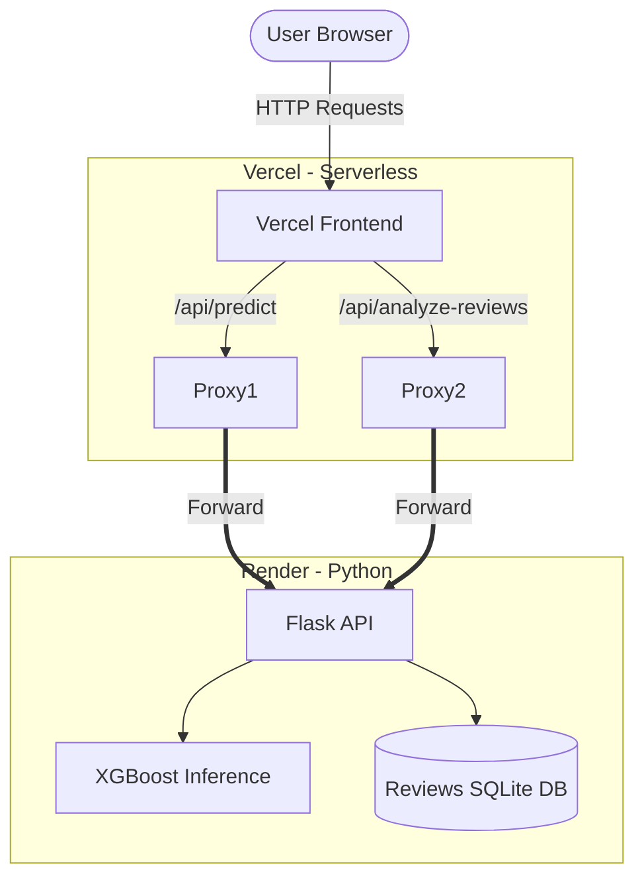

<div align="center">
  
  <h1>ListingLens — NYC Airbnb Price Intelligence</h1>
  <p><strong>End-to-end Machine Learning Application for Short-Term Rental Pricing & NLP Review Analysis</strong></p>

  [](https://listinglens-phi.vercel.app)
  [](https://listinglens-ru9r.onrender.com/health)
  [](#model-performance)

  <p>
    An intelligent pricing tool that estimates nightly Airbnb rates for any NYC property using <b>XGBoost</b>, <b>NLP sentiment analysis</b>, and <b>52 engineered features</b> trained on 20,700+ real listings.
  </p>
</div>

---

## 🌟 Key Features

- 🎯 **Accurate Nightly Pricing**: Predict prices with an XGBoost model (R² = 0.809) factoring in room type, location, amenities, and host quality.
- 📊 **Feature Explainability**: Understand *why* a price was predicted. See the top features driving the price via SHAP-inspired impact weights.
- 🧠 **NLP Guest Sentiment**: Integrate actual guest reviews. Enter an Airbnb Listing ID and the model will analyze review language (via VADER) to adjust the price estimate based on real quality signals.
- 📈 **Review Dashboard**: A dedicated tool to explore sentiment distribution, review quality scores (0-100), and topic themes (e.g., cleanliness, location, host) for any NYC listing.
- 📱 **Fully Responsive UI**: A modern, mobile-friendly interface built with Next.js 15, Recharts, and custom CSS variables.

---

## 🏗️ Architecture

To circumvent Vercel's serverless size limits for large ML dependencies (like Scikit-Learn and Pandas), ListingLens utilizes a **split-stack architecture**:



| Layer | Technology | Platform |
|---|---|---|
| **Frontend** | Next.js 15, TypeScript, React, Recharts | Vercel |
| **Backend API** | Python 3.12, Flask, Gunicorn | Render |
| **ML Model** | XGBoost Regressor (0.809 R²), StandardScaler | Render |
| **NLP Store** | Precomputed SQLite DB (VaderSentiment) | Render |
| **Data Source** | Inside Airbnb — NYC Nov 2025 (20.7k listings)| — |

---

## 🔬 Machine Learning Pipeline

The core ML engine was built with a reproducible pipeline (`run_pipeline.py`) structured in three phases:

### 1. Feature Engineering (52 total features)
- **Geographic**: Target encoding for neighbourhoods, Haversine distances to 5 major NYC landmarks, and K-Means spatial clustering (8 clusters).
- **Listing Details**: Room type, capacity, bedrooms, bathrooms, and boolean flags for premium amenities.
- **NLP Sentiment**: Precomputed VADER sentiment metrics (positive/negative %) and a proprietary 100-point Review Quality Score.
- **Interactions**: Engineered terms like `luxury_x_capacity` and `capacity_x_bedrooms`.

### 2. Model Selection & Tuning
- Tested Ridge Regression (Baseline), Random Forest, LightGBM, and XGBoost.
- **XGBoost** performed best. Hyperparameters were optimized using `RandomizedSearchCV` across 100 fits (20 configs × 5-fold CV).
- Prevented data leakage by splitting the train/test sets *before* applying neighborhood target encoding.

### 3. Model Performance
| Metric | Result | Context |
|---|---|---|
| **R² Score** | `0.809` | The model explains ~81% of pricing variance. |
| **MAPE** | `22.8%` | Average error margin (competitive for volatile real estate pricing). |
| **Top Driver** | `Room Type` | Accounts for 43.5% of model gain importance. |

---

## 🛠️ Local Setup & Development

### Prerequisites
- Node.js 18+
- Python 3.10+
- Git

### Installation

1. **Clone the repository:**
   ```bash
   git clone https://github.com/GARVS0205/airbnb-price-intelligence.git
   cd airbnb-price-intelligence
   ```

2. **Install Python dependencies:**
   *(It is recommended to use a virtual environment)*
   ```bash
   pip install -r requirements.txt
   ```

3. **Install Frontend dependencies & Run:**
   ```bash
   cd app
   npm install
   npm run dev
   ```

4. **View the app:**
   Open [http://localhost:3000](http://localhost:3000) in your browser.
   > **Note:** In local development, the Next.js API automatically spawns a local Python subprocess to run inference. You do not need to run a separate Flask server locally.

---

## 🚀 Deployment Guide

### 1. Backend (Render)
- Create a new **Web Service** tied to the repository.
- **Root Directory:** `app/`
- **Build Command:** `pip install -r requirements.txt`
- **Start Command:** `gunicorn -w 2 -b 0.0.0.0:$PORT server:app --timeout 120`

### 2. Frontend (Vercel)
- Import the repo into Vercel and set the **Root Directory** to `app/`.
- Set Environment Variable:
  - `PYTHON_API_URL` = `https://<your-render-app>.onrender.com`

---

## 📁 Repository Structure

```text
airbnb-price-intelligence/
├── app/                        # Next.js Frontend & Python Backend Root
│   ├── app/                    # React Pages & API Proxies (/predict, /reviews)
│   ├── components/             # Reusable UI Components
│   ├── models/                 # Serialized ML artifacts (.pkl, .json, .db)
│   ├── server.py               # Production Flask production entry point
│   ├── predict_api.py          # Inference script (called locally via subprocess)
│   └── review_analysis_api.py  # NLP dashboard script
├── src/                        # Machine Learning Source Code
│   ├── data_preprocessing.py   # Cleaning & imputation
│   └── feature_engineering.py  # Geographic & sentiment feature creation
├── run_pipeline.py             # End-to-end model training script
├── Project_Journey.md          # Complete documentation of the development process
└── requirements.txt            # Python environment dependencies
```

---

<div align="center">
  <p>Built with ❤️ for data science and web engineering.</p>
</div>
